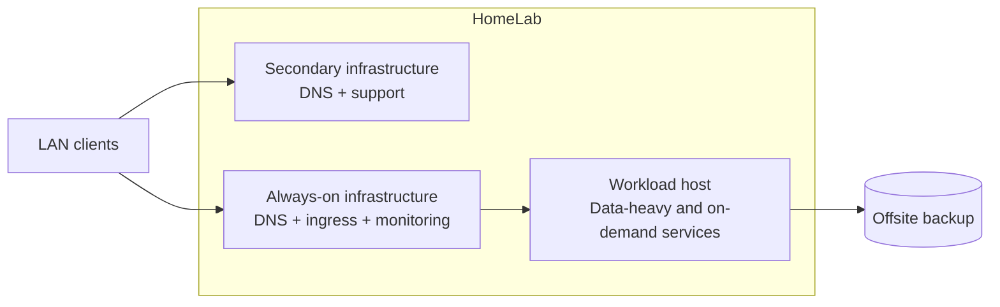

# Architecture overview

The live HomeLab has a small number of roles rather than a large cluster.

The public view intentionally stops at those roles:

The important choice is not the number of machines. It is the separation of responsibilities.

Always-on infrastructure should not disappear because a workload host is sleeping, being maintained or recovering. Heavy application state should not turn the basic network services into the largest failure domain.

## Boundaries

The architecture is intentionally conservative:

- Git describes intended configuration.
- Runtime observation is separate from desired state.
- Monitoring observes; it does not authorize deployment.
- CI checks repository state; it does not deploy Production.
- Backup execution and restore proof are separate.
- User-facing convenience tools sit on top of canonical mechanisms instead of becoming new authorities.

This page is a model, not a current inventory. Exact placement remains private because it changes more often and exposes more than the engineering point requires.
